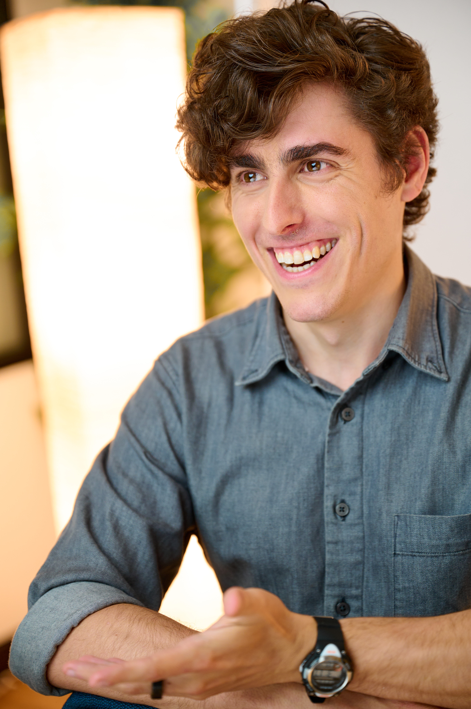

I'm a straight man, <text id="age"></text> years old.

I live an intense, pseudo-ascetic, life, focused on altruistic work, self-improvement, and personal-spiritual integrity.

I'm looking to go on dates with new people, with the possibility of long or medium-term partnership. I'm open to both monogamous and polyamorous relationships.

(More photos [here](personal-photos.html).)

What I Want
-----------

I’m attempting to live with an [open heart](https://threadreaderapp.com/thread/1364023511983923202.html), robust ethics, and scrupulous epistemic standards. Above everything else, I want relationships, romantic or otherwise, that support and nourish me in that.

I'm open to two pretty different flavors of relationship:

*   a low-time-commitment, high-intimacy, companionship, on the one hand,
*   and a high intensity, high commitment, long-term Partnership, on the other.

### Weekly-ish companionship

Currently, I’m mainly looking for more companionship in my life.

I would like to have someone to spend time with about once a week: talking, circling, cuddling, having sex, being curious together, all with a practiced expectation of being fully honest with each other about our desires and our relationship.

This kind of relationship amounts to approximately what poly people call a "secondary partnership": emotionally intimate, but not the primary structure of one's life. This might work best for someone who already has a primary partner, or who is otherwise committing most of their energies to a high intensity project.

([This somewhat-out-of-date document](https://docs.google.com/document/d/1fyXcXT8yKdkxSxdkc1G4709NFBtfC6WVZym5rdbcS_s/edit?usp=sharing) gives some ideas for what that could look like, given my focus on my work.)

### High-intensity Partnership (with a capital P)

In the long run, I would like to find a _spiritual collaborator_\*, for the other half of an _altruistic power couple_.

I want a Partnership with someone relentlessly and ambitiously dedicated to improving the world, who is striving to grow in skill and wisdom, and who will mutually support me in doing the same. A relationship in which we work together, train together, rest together, and help each other to live in integrity with our values. This entails, among other things, spending a lot of time _working_, and almost no time on conventional leisure activities (like watching movies together or going to parties).

When I've dated people in the past, I've spent a lot of time and attention trying to help them get better. For example, or having long conversations (or writing personalized essays) to convey the blindspots I observe in my partner's in-practice philosophy, or working with her to triangulate her skill gaps and to develop practice exercises that address them. Ideally, I'd like a partner who orients towards _me_ and and _my_ weaknesses in a similar way—actively looking out for the things that I'm missing, then helping me to see them, understand them, and improve them, with skill and compassion.

I have been seeking something like this since I was 15. It’s one one of the desires that I hold closest to my heart. But, at this point, I’m mostly not expecting to find/develop this kind of Partnership, at least before the singularity. Currently, I am constructing a life in which I can learn, and get better, and execute effectively, without the support of a life partnership. But at the same time, I'm _also_ keeping out feelers in case an extremely compatible woman, who is also living this kind of life, crosses my path.

(Some more operationalization of what this kind of relationship might look like [here](https://docs.google.com/document/d/11ZikhCHkCsii2ecOAlZG4UO4o2xXVLz7DYIjebmE0K0/edit?usp=sharing).)

\* - To be clear, I am an atheist and an antitheist. It is an extremely important fact about the universe (and about my worldview) that we are [beyond the reach of God](https://www.lesswrong.com/posts/sYgv4eYH82JEsTD34/beyond-the-reach-of-god). But I am deeply concerned with matters of the spirit, no matter that souls turn out to be implemented by neurons.

The life I'm living
-------------------

I’m often happiest when I’m working, and when my life is going well, I work a lot. Most days, I’m working, or [explicitly resting](https://docs.google.com/document/d/1ctnO9pwF7Ti7AjyYGoSiiTzAHidUZn-mZ4EvwHqPl9M/edit?tab=t.0#heading=h.i24l245gvr44), from 30 minutes after waking up to shortly before sleep (with a daily break for intense exercise). I structure my day to maximize my [energetic amplitude](https://github.com/Etyre/Methodology-documents/blob/main/Energy%20and%20Intentionality%20Modulation.md), so that to a first approximation, I’m either intensely alert and focused, or napping, but rarely in a middling state. I aggressively optimize for [excellent sleep](https://wild-quit-ebe.notion.site/Sleep-process-and-policies-6f7a204833a34d4b99ad44860258ca7c).

I very rarely socialize outside of work. When I see my friends, it's almost always for one of us to help the other think through a personal problem. I eat one meal a day (the plurality of the time, it's kale, sauteed in olive oil, with toasted tofu). I only very occasionally watch movies or TV, and generally set myself up to [avoid passively consuming content](https://wild-quit-ebe.notion.site/Passive-consumption-and-addiction-distraction-policies-e9467e7d3d2b479a8847f2da6c70063d) (eg I write at least one sentence about every piece I read).

Outside of my core altruistic projects, I spend time exercising, reading (mostly AI stuff, history books, sometimes textbooks), writing [blog posts](https://musingsandroughdrafts.com/), and sometimes hacking on [small software projects](https://github.com/Etyre). On the scale of months, I’m often doing some progression of deliberate self-development: identifying a pressing skill gap, and then iteratively designing and doing exercises to develop the relevant subskills. I review anki most days.

Most weeks, I take off [one day](https://wild-quit-ebe.notion.site/Notes-on-rest-days-0415bdc2c6d748f190ba21481acc2a3c) (and one evening) to rest, decompress, and do whatever feels most nourishing. Some rest day activities: journaling, reading, writing, strength training, cleaning up my room, singing and memorizing folk songs (while walking around the neighborhood), going to the dog park to spend time with the dogs, meditating. When I’ve had a partner, I’ve enjoyed cuddling with her.

When I have the capacity to take time off from work, I like doing doing various kinds of workshops and trainings, especially those that give me experience with interesting psychological states or faculties: [meditation](https://www.jhourney.io/), [improv](https://www.keithjohnstone.com/home), [therapy techniques](https://www.coretransformation.org/), etc. (I don't do drugs, though.)

(Additional detail on my weird, intense, lifestyle can be found [here](https://docs.google.com/document/d/1LRc22DoIj1NXCDyK02x4Aaa5-Ddg0Bk6_xwuAfz9X6c/edit?tab=t.0#heading=h.uzfwmjb33czm).)

Constraints and relationship-essentials
---------------------------------------

### Work

Out of a combination of personal inclination and moral commitment, I work a lot. I'm genreally at the office almost all my waking hours, 6 days a week (and usually for a few hours on my rest day, as well).

Anyone dating me in any recurring way will need to be ok with me working that, either because you have a similar orientation to the world themselves (maybe we can spend time coworking together?), or because you’re comfortable with a relationship that is emotionally intimate without being time-intensive.

### Honesty

The thing that is most important to me in all of my personal relationships is skilled honesty.

I've sometimes been in a context where there was a [forbidden conversation](https://mindingourway.com/steering-towards-forbidden-conversations/), some true fact, or some belief I held, that I didn't feel free to acknowledge. In a situation like this, I feel pressure to pretend about, or distract from, or downplay the thing.

I’ve come to think that I can’t build a robust relationship on a foundation of this kind of holding back. I want to participate in contexts where I can be fully honest, and it is safe and practical for people to be fully honest with me, up to and including all of things that it is usually not polite or acceptable to say.

Creating those kinds of contexts by merely _intending to be honest_ isn't sustainable. It requires skill to say the things that can't usually be said, in a way that doesn't do undue harm.

I make explicit considered effort in all my important relationships, to build an API such that the two of us can say anything (including our judgements, frustrations, and deep feedback) in a way that the other party can hear it without feeling attacked. And I’ve sought to develop the skills to support this kind of honesty, [Nonviolent Communication](https://smile.amazon.com/Nonviolent-Communication-Language-Life-Changing-Relationships/dp/189200528X/ref=sr_1_1?dchild=1&keywords=nonviolent+communication&qid=1627363910&sr=8-1), [rationality](https://musingsandroughdrafts.com/2019/09/27/basic-double-crux-pattern-example/), and [circling](https://circlinginstitute.com/what-is-circling-method/) skill.

But even so, I am not a master at this. I still sometimes find myself in situations where there's something that feels too awkward to share even in otherwise candid relationships. I need help to maintain this kind of connection.

It is important to me that, between the two of us, we have enough skill to maintain this kind of connection: that it continues to feel possible, for you and for me, to share what’s up for us, even if that is uncomfortable or impolite or awkward. This is crucial for me in an intimate relationship.

### Meta

Relatedly, relationships with me typically involve a lot of “meta”: doing checkins, talking about the relationship and how it is or isn't working, flagging frictions and generating creative solutions together, investing effort trying to improve our communication processes, etc.

Some past partners have found this onerous or annoying. “Can’t we skip all the process talk, and just do the cool things that the relationship is about?” I don’t see it that way. Much of what I care about in a relationship is the strength of the relationship itself, and this sort of meta and process-iteration is a means to that.

Completely unironically, leaving comments on my relationship-communication google docs is one of my love languages. (The google doc format is optional. That's just a communication method that has worked well for some past partners.)

### Relationship style

I'm dispositionally monogamous, generally preferring to commit to only one person. However, I am happy to date people who have other partners themselves, especially if I can see that that makes them happy.

I have only ever seriously dated one person at a time, and incidentally, I have only ever seriously dated people who were poly. (Effectively, I was monogamously partnered with someone who was dating other people.)

I am more than willing to participate in a fully-monogamous partnership, if we're a good fit. I've dated poly people, not because I particularly prefer poly, but because the people I've been interested in have been poly.

### Kids

Raising kids appeals to me, but I’m not currently planning around having a family in the pre-singularity. However, I would do that if I found a _highly_ compatible partner and having kids was important to her.

That is to say, I am _open_ to having kids, but only if we are an exceptionally good match.

(I might actively seek out a partner for raising a family after humanity is out of the [acute risk period](https://www.lesswrong.com/tag/acute-risk-period) and life extension is solved.)

### Sex

Sex is more important to me in the case of a once-or-twice-a-week companion than in the case of a committed Partnership. The point of having a capital-P partnership is mostly to help each other be better. For that, sex can be nice, but it isn't necessary. In the case of a more casual relationship, sexual and intimate emotional satisfaction is a larger fraction of what I care about.

I’m interested in doing deliberate practice to get good at sex: focusing on my partner’s experience, with ample verbal and nonverbal feedback (plus after-action debriefs). It would obviously be better to do this with an emotionally-intimate partner, but I'm potentially open to trying with someone who I'm not otherwise dating, if we can establish really good communication and clarity about expectations first.

### Vegetarianism

I'm vegan (with [some caveats](http://elityre.com/vegan-policy.html)). So far, 100% of the people that I've dated seriously and 100% of the people that I've ever been in love with have been vegan. This is mostly correlation—the sort of people that I tend to be attracted to tend to be vegans. But it's _also_ causal—I care about the ethics of the people I spend time with. For most people, eating factory farmed meat is the habit that causes the most direct harm to others. (Additionally, seeing someone eat meat tends to reduce my level of attraction for them.)

I'm not confident, but I think I probably don't want to date people who aren't vegetarian, or who aren't otherwise careful about the externalities their life has on animals in factory farms.

I'm not listing this as a firm deal-breaker, but it is important to me. If you eat factory farmed meat, and we get moderately far into dating, I'll want to have an honest and reasoned conversation with you about the ethics and tradeoffs involved.

(I'm conscious that abstaining from animal products entirely is not a healthy choice for some people, and that there are additional tradeoffs.)

Some friends' descriptions of me:
---------------------------------

Friend 1: _"Erudite, stoic, and unrelentingly devoted to good. Also a little bit clumsy, but you can leave that part out.”_

Friend 2: _"Human, on the lower end of height but upper percentage of brain capacity with a weird interest in saying true things, keeping commitments, and deliberately practicing skills he wants to get good at."_

Friend 3: _“Eli is kind of what you would imagine a human might be like if you hadn't met any humans but had built a lot of houses.”_

If you want to say hello...
---------------------------

If any of the above sounds interesting to you, or even if you just want to say hi, press this button to tell me your name and a few sentences about you (or just email me [here](elityre@gmail.com)). Maybe we can meet up the next time we're in the same metropolitan area.

I'm grateful to everyone who takes initiative and reaches out, even if it turns out we're not a good match. In [an important way](https://www.lesswrong.com/tag/timeless-decision-theory), your doing that is the only reason this system works at all. So thank you.

If you would like more detail about who I am, or what I care about, you might explore the rest of this site, particularly the [public statements page](statements-index.html), or flip through my [blog](https://musingsandroughdrafts.com/) and/or [archived twitter threads](https://threadreaderapp.com/user/EpistemicHope).  

  

Aid my quest!
-------------

If you’re not a good match with me (you’re male, or married, or want something different than I do), but you'd like this project to succeed, you can help by connecting me with thoughtful, single (or non-polysaturated) women who want the sort of thing that I want. If you took even 5 minutes right now to flip through your facebook friends and consider if any of them might want to date someone like me, you will earn my [gratitude](bounties.html).